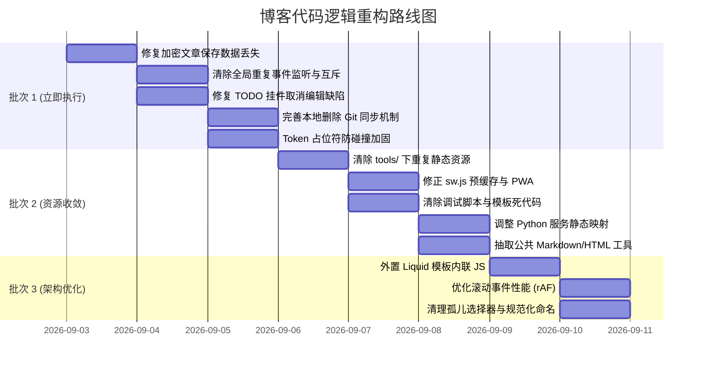

# 全面代码逻辑审查报告与分批重构方案

> **评审日期**：2026-09-03  
> **审查基线**：`main` 分支最新提交  
> **覆盖范围**：发帖器（Composer 前端与 Python 后台）、Jekyll 模板与脚本、自动化批处理与样式系统

---

## 目录
1. [项目整体架构与质量评估](#一项目整体架构与质量评估)
2. [六大审查维度详细分析](#二六大审查维度详细分析)
3. [按严重程度划分的问题清单](#三按严重程度划分的问题清单)
   - [高严重度（High）：数据损坏、并发竞争与核心失效](#31-高严重度high数据损坏并发竞争与核心失效)
   - [中严重度（Medium）：架构漏洞、死代码与逻辑脱节](#32-中严重度medium架构漏洞死代码与逻辑脱节)
   - [低严重度（Low）：性能损耗、规范异味与维护冗余](#33-低严重度low性能损耗规范异味与维护冗余)
4. [分批次重构执行计划](#四分批次重构执行计划)

---

## 一、项目整体架构与质量评估

### 1.1 架构简述
本项目本质上是一个个人静态博客（Jekyll + GitHub Pages），并集成了一套“发帖器”（Post Composer）：
- **本地模式（Local Engine）**：由 `tools/post_composer_server.py` 驱动的 Python HTTP 本地后台服务，支持本地 Markdown 保存、图片落盘并自动调用 Git 提交推送。
- **云端模式（Cloud Engine）**：前端直接通过 GitHub REST API，在浏览器端进行身份校验、文章增删改查与图片 Base64 提交，支持离线/移动端无服务器写作。

### 1.2 整体评分：**6.0 / 10（及格边缘）**
- **优点**：
  1. 双引擎架构设计非常实用，兼顾了本地开发的高效与移动端云端直发的便利；
  2. 有基本的安全防范（XSS 白名单过滤、路径遍历校验、Token 比对）；
  3. 写作体验细腻（支持 PWA、快捷键、AES 加解密、自动暗色适配）。
- **严重问题（典型异味）**：
  1. **文件级的盲目克隆与复制粘贴**：`composer/` 与 `tools/` 两套同义代码长期并存，版本完全脱节，造成 Service Worker 预缓存全部 404；
  2. **潜伏致命数据丢失**：加密文章如果未解密直接保存，原文会直接被占位符覆盖，原文永久丢失；
  3. **单体脚本臃肿杂乱**：发帖器前端 1700 行无模块化 JS，Jekyll 模板中内嵌数百行复杂 JS；
  4. **并发与事件监听缺陷**：快捷键重复监听导致双倍并发提交，多线程 Python 后台缺少文件锁。

---

## 二、六大审查维度详细分析

### 维度 1：代码结构问题
- **超长函数与单体脚本**：
  - `composer/app.js`（1716 行）：平铺 70 余个 DOM 查询，混杂了网络通信、状态管理、加解密与渲染；
  - `tools/post_composer_server.py`（987 行）：混杂了 CLI 解析、进程管理、Git 执行封装、文件读写、CORS/CSP 安全头与静态资源分发；
  - `_layouts/default.html`、`_layouts/post.html`、`_includes/site-nav.html`：在 HTML 模板中内联数百行复杂 JS 脚本；
  - `assets/css/custom.css`（2618 行）：单体样式表严重膨胀，缺乏模块拆分。
- **深层嵌套与脆弱解析**：
  - `post-composer-renderer.js`：手写正则解析器，多层递归处理列表与块级引用；
  - `post_composer_server.py`：`ComposerRequestHandler.do_POST` 采用巨型 `if/elif` 分支，缺乏路由分发机制。

### 维度 2：重复代码
- **全文件克隆**：
  - `composer/app.js` $\equiv$ `tools/post-composer-app.js`
  - `composer/style.css` $\equiv$ `tools/post-composer.css`
  - `composer/index.html` $\equiv$ `tools/post-composer.html`
  - `composer/manifest.json` $\equiv$ `tools/manifest.json`
  - `composer/crypto-js.min.js` $\equiv$ `tools/crypto-js.min.js`
  - `composer/renderer.js` $\equiv$ `tools/post-composer-renderer.js` $\equiv$ `assets/js/post-composer-renderer.js`（3 处完全相同）
- **逻辑重复**：
  - `escapeHtml` 工具函数在 4 个文件中各自手写一遍；
  - `Ctrl+Enter` 和 `Ctrl+S` 在 `app.js` 的 `window` 与 `document` 上被监听了两次；
  - `tagsInput` 回车/逗号事件被注册了两次；
  - 日期格式化逻辑在多处各自实现。

### 维度 3：命名规范
- **文件命名不一致**：
  - 根目录脚本：`Open Post Composer (App).vbs`、`Open Post Composer.cmd`（空格 + 首字母大写）；
  - `tools/` 脚本：`start-local-preview.ps1`（烤肉串命名）、`Create-Desktop-Shortcut.ps1`（帕斯卡命名）、`post_composer_server.py`（蛇形命名）。
- **属性与变量风格混用**：
  - 属性名拼写不一致（`cancel-edit` vs `cancel`）；
  - 数据模型中驼峰 `publishAt` 与下划线 `encrypted_data` 混杂。

### 维度 4：耦合度
- **路径强耦合与虚假映射**：
  - Python 服务器硬编码了特定文件名路由映射，且部分条件因顺序问题无法触发；
  - 静态页面中硬编码了本地服务端口（`http://127.0.0.1:4173/`）。
- **Git 状态解析强耦合**：
  - 服务端深度依赖 `git status`、`git diff`、`git rev-parse` 的标准输出格式。

### 维度 5：逻辑缺陷
- **数据丢失**：加密文章二次编辑未解密时保存导致原文被冲掉；
- **并发冲突**：双事件触发并发发布；多线程并发缺少互斥锁；
- **失效交互**：待办事项“取消编辑”按钮事件属性名与逻辑判断不匹配；
- **脱节行为**：本地模式删除文章只删物理文件，不执行 `git rm/commit/push`。

### 维度 6：可维护性
- **离散的魔法数字**：端口（`4173`、`5173`）、文件大小阈值（`5MB`、`25MB`、`36MB`）、行内统计系数（`350`、`200`）；
- **死代码残留**：未编译的 Liquid 模板 `tools/posts.json`、不生效的局域网 Host 规则、孤儿选择器 `#todo-section-copy`、调试脚本 `capture_openai_requests.py`。

---

## 三、按严重程度划分的问题清单

### 3.1 高严重度（HIGH）：数据损坏、并发竞争与核心失效

#### [H-01] 加密文章未解密保存导致正文永久丢失
- **位置**：`composer/app.js:480-494` 与 `928-974`
- **根因**：用户打开加密文章但未输入密码解密时，正文内容为占位提示。当点击保存时，若未填密码，代码将占位符作为明文正文写入，且未携带 `encrypted_data`，导致原文彻底丢失。
- **对策**：在 `state` 中锁定未解密的密文字段；若未解密，禁止覆盖正文，或严格保留原有加密数据。

#### [H-02] 双重 keydown / tags 事件监听导致并发重复发布与竞争
- **位置**：`composer/app.js:1370-1379`、`1529-1543`、`1438-1443`、`1521-1526`
- **根因**：`window` 和 `document` 同时绑定了 `Ctrl+Enter` 和 `Ctrl+S`。单次按键触发两次 `publishPost()`，造成并发本地 Git 操作或并发 GitHub API 提交冲突；`tagsInput` 同样被重复注册两次。
- **对策**：清理冗余监听，只保留 `document` 单一监听源，并为发布流程增加严格互斥锁（Busy Lock）。

#### [H-03] 静态资源全量双目录冗余导致 Service Worker 缓存失效
- **位置**：`composer/` 目录 与 `tools/` 目录；`composer/sw.js:3-13`
- **根因**：发帖器静态资源在两处各存一份且命名不同。`sw.js` 预缓存的是 `post-composer-app.js` 等不存在的路径，真正使用的 `app.js`、`style.css`、`renderer.js` 未被缓存，导致 PWA 离线功能失效。
- **对策**：确立以 `composer/` 为单一权威源，删除 `tools/` 下多余的复制文件，纠正 `sw.js` 缓存路径。

#### [H-04] TODO 待办事项“取消编辑”按钮事件类型不匹配导致功能失效
- **位置**：`assets/js/home-todo.js:173, 344`
- **根因**：HTML 渲染为 `data-action="cancel-edit"`，而事件分发只判断 `action === "cancel"`，点击取消编辑没有任何响应。
- **对策**：统一属性名为 `data-action="cancel"` 或在判断逻辑中兼容两者。

#### [H-05] 本地发帖器删除文章未同步 Git 提交，产生脏工作区
- **位置**：`tools/post_composer_server.py:503-535`、`composer/app.js:1457-1463`
- **根因**：本地模式下删除文章仅执行了本地文件 `unlink`，没有执行 `git rm`、`commit` 和 `push`，导致本地工作区存在未追踪删除且远程不会同步。
- **对策**：在服务端 `delete_post` 中加入可选或默认的 Git 提交流程，并在前端提供明确同步提示。

---

### 3.2 中严重度（MEDIUM）：架构漏洞、死代码与逻辑脱节

#### [M-01] 多线程 HTTP 服务器缺乏 Git 进程排队互斥锁
- **位置**：`tools/post_composer_server.py:698-815, 974`
- **根因**：`ThreadingHTTPServer` 在处理并发请求时直接并行运行 `git` 命令，极易触发 `.git/index.lock` 冲突导致 500 报错。
- **对策**：引入 `threading.Lock` 保护所有涉及 Git 和文件的写操作。

#### [M-02] 自定义 Markdown 渲染器存在 Token 碰撞漏洞
- **位置**：`assets/js/post-composer-renderer.js:112-118, 153`
- **根因**：使用 `%%TOKEN_0%%` 纯文本做行内占位替换，若用户正文本身含有该字符会导致内容被意外污染或变为 `"undefined"`。
- **对策**：改用不可见控制字符加随机哈希前缀（如 `\x00_TOKEN_${salt}_`）保证唯一性。

#### [M-03] 未编译的 Liquid 模板被当作 JSON 直接下发给前端
- **位置**：`tools/posts.json:1-18`、`composer/app.js:713-718`
- **根因**：盲目从 `composer/` 拷贝到 `tools/`，由于 `tools` 在 Jekyll 排除列表中，该文件不会被编译，本地请求解析必然抛出 JSON 语法错误。
- **对策**：移除 `tools/posts.json`，本地统一由 `/api/posts` 动态提供。

#### [M-04] 服务端静态路由存在死代码与无效的局域网放行
- **位置**：`tools/post_composer_server.py:821, 917-919, 974`
- **根因**：前置分支已命中返回，后置 `if normalized in ...` 为纯死代码；正则放行了 LAN IP，但实际只监听 `127.0.0.1`。
- **对策**：移除死路由，根据实际需求决定是否绑定 `0.0.0.0`。

#### [M-05] 孤儿调试脚本与硬编码绝对路径
- **位置**：`tools/capture_openai_requests.py:1-32`
- **根因**：硬编码本地绝对路径 `D:\Codes\MyWeb\...`，依赖未声明的第三方库 `mitmproxy`，属残留调试垃圾。
- **对策**：直接从仓库中清理删除。

#### [M-06] 发帖器前端 1700 行无模块化 JS
- **位置**：`composer/app.js`
- **根因**：网络交互、DOM 操作、状态存储、加解密等高耦合塞在单文件内。
- **对策**：按职责拆解为子模块。

---

### 3.3 低严重度（LOW）：性能损耗、规范异味与维护冗余

#### [L-01] Jekyll 模板内嵌数百行复杂 JS 脚本
- **位置**：`_layouts/default.html:76-234`、`_includes/site-nav.html:27-149`、`_layouts/post.html:96-281`
- **根因**：Spotlight 导航特效、评论主题同步等逻辑直接内嵌在模板中，无法享受缓存和工程化检查。
- **对策**：抽取为独立的 `.js` 资源文件通过外链引用。

#### [L-02] 未节流的滚动监听导致回流重绘（Layout Thrashing）
- **位置**：`_layouts/post.html:124-134`
- **根因**：阅读进度条在每个 `scroll` 事件中同步读取 `scrollHeight` 等几何属性。
- **对策**：引入 `requestAnimationFrame` 调度并开启 `{ passive: true }`。

#### [L-03] 工具函数多处重复实现
- **位置**：`escapeHtml`（4 处）、日期与补零逻辑（多处）。
- **对策**：抽取公共 `utils.js` 统一调用。

#### [L-04] 全仓脚本命名风格不统一
- **位置**：根目录与 `tools/` 目录。
- **对策**：统一使用 kebab-case 规范。

#### [L-05] 散落的硬编码魔法端口与数字
- **位置**：`4173`、`5173` 端口硬编码分散在多语言脚本中。
- **对策**：配置文件集中声明。

---

## 四、分批次重构执行计划

为保证项目稳定演进且不影响日常写作，制定如下三批次治理方案：

### 批次 1：核心逻辑与数据安全紧急止血（立即执行）
1. **[H-01] 加密文章保护**：修改 `composer/app.js`，保存时若检测到未解密状态，保留原有 `encrypted_data` 及相关元数据，杜绝正文被占位符冲掉。
2. **[H-02] 清理重复监听**：移除 `composer/app.js` 中 `window` 上的多余 `keydown` 监听及 `tagsInput` 重复监听，增加发布中（isBusy）状态拦截。
3. **[H-04] 修复 TODO 取消按钮**：修改 `assets/js/home-todo.js`，修正 action 名称匹配，使 Cancel 按钮正常工作。
4. **[H-05] 完善本地删除逻辑**：在 `tools/post_composer_server.py` 的 `delete_post` 逻辑中完善对 Git 状态的处理。
5. **[M-02] 加固 Markdown 占位符**：优化 `assets/js/post-composer-renderer.js` 中的临时 Token 生成机制，避免内容碰撞。

### 批次 2：去重与单一权威源收敛
1. **[H-03] 消除重复文件**：以 `composer/` 为唯一基准，删除 `tools/post-composer-app.js`、`tools/post-composer.css`、`tools/post-composer-renderer.js`、`tools/post-composer.html`、`tools/posts.json`。
2. **[H-03] 修正 Service Worker**：更新 `composer/sw.js` 缓存列表，使真正使用的文件能够被正确预缓存。
3. **[M-04] 重构 Python 服务路由**：清理 `tools/post_composer_server.py` 中的无效路由和死代码，统一代理到 `composer/`。
4. **[M-05] 清理残留文件**：删除 `tools/capture_openai_requests.py`。
5. **[L-03] 抽取通用工具函数**：统一全仓 `escapeHtml` 实现。

### 批次 3：架构解耦与前端性能治理
1. **[L-01] 外置模板 JS**：将 `_layouts/default.html`、`_layouts/post.html`、`_includes/site-nav.html` 中的内联 JS 提取至 `assets/js/` 独立文件中，减少 HTML 体积并享受缓存。
2. **[L-02] 性能调度优化**：为阅读进度条等滚动监听添加 `requestAnimationFrame` 节流调度。
3. **[L-03/04] 规范与死代码清理**：清理 `home-todo.js` 中无效的 DOM 查询，统一定义端口与配置常量。
